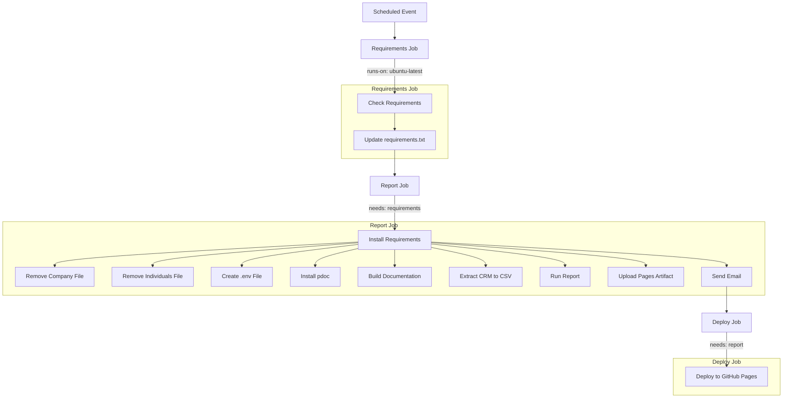

# NeonCRMAnalytics


This repo contains a Python program for analyzing the data of a NEON CRM. The data is exported to CSV, which allows you to check the data for inconsistencies using Microsoft Excel.

### Python Version
3.12 (Specifically tested on MacOS using Python 3.12.3 and 3.12.4)

## Run Locally

Clone the project

```bash
git clone https://github.com/SACCSF/NeonCRMAnalytics.git
```

Go to the project directory

```bash
cd NeonCRMAnalytics
```
Create virtual environment
```bash
# For MacOS and Linux
python3 -m venv .venv
source .venv/bin/activate

# For Windows
python -m venv .venv
".venv/Scripts/activate"
```

Install dependencies

```bash
  pip install -r requirements.txt
```

Create a `.env` file in the root directory and add the following variables:

```bash
API_ORG_ID
API_API_KEY=
```

Run the program

```bash
# For MacOS and Linux
python3 extract_crm_to_csv.py 
python3 create_report.py

# For Windows
python extract_crm_to_csv.py 
python create_report.py
```

Grab the `report.html` file from the docs folder and open it in your browser.

## Auto-generated Documentation
The documentation is automatically generated and can be found [here](https://saccsf.github.io/NeonCRMAnalytics/). The workflow is as follows:



## Authors

- [@nicola-hermann](https://github.com/nicola-hermann)
- [@flawas](https://github.com/flawas)

